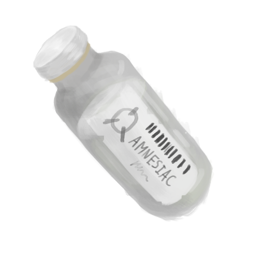

<p align=center>
    <a href="../../">
        </a>
    <a href="../tree">
        </a>
</p>
<h1 align="center">AMNESIAC</h1>

# ITEM FILE

```
> Get amnesiac.dnx
Loading...
Retreaving amnesiac.dmx
[####________________]
```

# EMPLOYEE STATS

| APEARANCE | EFFECT/INTERACTION |
| - | - |
| ITEM | ??? |

<p align="center">
    
    
</p>
<p align=center>
    <a href="../../">
        </a>
    <a href="../tree">
        </a>
</p>