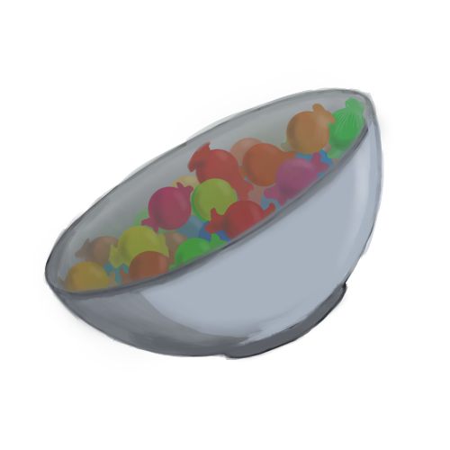

[](https://raven-sgwc.github.io/SCP-FC/)
[](https://raven-sgwc.github.io/SCP-FC/web/tree)

<h1 align="center">SCP-330</h1>

# SCP FILE

```
> Get SCP-330.dnx
Loading...
Retreaving SCP-330.dmx
[################____]
```
```
AJ1Nol0eCYWqFS39S13Y8iwpfxGdx5UOfpAf/NfNw66
IjOP3JSV/tcWfG6js9hx6UzyiLMwJaawPdvxbOufERg
RGwnCgF6FBZ5FbML9lJ3w5YuLHZDDVoVQiRO9k3m4Pq
uCMOnSM6QAss/U2/8aeCuvaj4PukNEh3hX2Qa6Pn4yf
7NBLTlBM/leiLgp+v0UEhjdbCIiqkJOPxkclhDPPHIH
wUV7JbDk+FdLHYI4GeTTB6U3Ztb0VDIwbr22qfhRtPB
iLBI7XmJveFHsaduiuiaw3zhjV hands seperated.
```

# Audiolog Incident ██-██-████

| Logged Person | Context |
| - | - |
| Dr.█████ | What happend here? |
| Janitor | I dont know. I just came here and found those hands. Not the first time this happend. |
| Dr.█████ | How? |
| Janitor | You see that bowl? Take more then 2 candies out of this bowl and you loose your hands. |
| Dr.█████ | So he got greedy? |
| Janitor | I guess. |

# SCP STATS

| APEARANCE | EFFECT/INTERACTION | CTCrVmX3OT5PEaJq3c8wJ | rZW1Ap1IOua3j | LHZDDVoVQiRxjOZO9k | 
| - | - | - | - | - |
| RANDOM CARD | SEPERATED HAND EVENT | a6Pn4yf7NBLTlBM/le | br232qfhRt | l0eCbzssaiGzWi |

[](./330#scp-stats)

[](https://raven-sgwc.github.io/SCP-FC/)
[](https://raven-sgwc.github.io/SCP-FC/web/tree)

