<html lang="en">
<head>
    <meta charset="UTF-8">
    <meta name="viewport" content="width=device-width, initial-scale=1.0">
    <meta name="description" content="This is the description for my GitHub Pages site.">
    <title>All Entries | SCP:FC</title>
    <link rel="icon" href="https://nalu-sgwc.github.io/SCP-FC/assets/images/misc/BETA_WIKI.png" type="image/png">
</head>
</html>

    
    
    
    
    
    
    
    

<h1 align="center" tabindex="0">BETA WIKI ENTRIES</h1>

are all sites listed, that are in this Wiki.

Most of the text is clickable and contains hyperlinks to their page/category

<h2 id="new">NEW</h2>

- Many wiki entries incl. scp's, achivements.

<h2 id="categories" tabindex="1">CATEGORIES</h2>

<table>
    <thead>
      <tr>
        <th>CATEGORY</th>
        <th>LOGS</th>
        <th>INCIDENTS</th>
        <th>ENTRIES</th>
        <th>COMPLETED</th>
      </tr>
    </thead>
    <tbody>
      <tr>
        <td>TOTAL</td>
        <td>2</td>
        <td>1</td>
        <td>75/140</td>
        <td>8/140</td>
      </tr>
      <tr>
        <td><a href="./tree#scps" style="color:white">SCP’s</a></td>
        <td>1</td>
        <td>1</td>
        <td>51/51</td>
        <td>0/51</td>
      </tr>
      <tr>
        <td><a href="./tree#safe" style="color:green">SAFE</a></td>
        <td>1</td>
        <td>1</td>
        <td>24/24</td>
        <td>0/24</td>
      </tr>
      <tr>
        <td><a href="./tree#euclid" style="color:yellow">EUCLID</a></td>
        <td>0</td>
        <td>0</td>
        <td>19/19</td>
        <td>0/19</td>
      </tr>
      <tr>
        <td><a href="./tree#keter" style="color:red">KETER</a></td>
        <td>0</td>
        <td>0</td>
        <td>8/8</td>
        <td>0/8</td>
      </tr>
      <tr>
        <td><a href="./tree#apollyon" style="color:purple">APPOLYON</a></td>
        <td>0</td>
        <td>0</td>
        <td><del>1/1</del> 0/0</td>
        <td><del>0/1</del> 0/0</td>
      </tr>
      <tr>
        <td><a href="./tree#characters" style="color:white">CHARACTERS</a></td>
        <td>1</td>
        <td>0</td>
        <td>11/28</td>
        <td>0/28</td>
      </tr>
      <tr>
        <td><a href="./tree#items" style="color:white">ITEMS</a></td>
        <td>0</td>
        <td>0</td>
        <td>1/8</td>
        <td>0/8</td>
      </tr>
      <tr>
        <td><a href="./tree#events" style="color:white">EVENTS</a></td>
        <td>0</td>
        <td>0</td>
        <td>1/12</td>
        <td>0/12</td>
      </tr>
      <tr>
        <td><a href="tree#deaths" style="color:white">DEATHS</a></td>
        <td>0</td>
        <td>0</td>
        <td>0/18</td>
        <td>0/18</td>
      </tr>
      <tr>
        <td><a href="tree#achivements" style="color:white">ACHIVEMENTS</a></td>
        <td>0</td>
        <td>0</td>
        <td>11/11</td>
        <td>8/11</td>
      </tr>
      <tr>
        <td><a href="tree#endings" style="color:white">ENDINGS</a></td>
        <td>0</td>
        <td>0</td>
        <td>0/7</td>
        <td>0/7</td>
      </tr>
    </tbody>
</table>

<h2 id="scps" tabindex="2">SCP's</h2>

<h3 style="color: green" id="safe">SAFE</h3>

<table>
    <thead>
      <tr>
        <th>ENTRY ITEM</th>
        <th>WARNINGS</th>
        <th>LOGS</th>
        <th>INCIDENTS</th>
        <th>IMAGE</th>
        <th>COMPLETED?</th>
      </tr>
    </thead>
    <tbody>
      <tr>
        <td><a href="./scp/safe/111" style="color:green">SCP-111</a></td>
        <td>FIRE HAZARD</td>
        <td>0</td>
        <td>0</td>
        <td></td>
        <td>❌</td>
      </tr>
      <tr>
        <td><a href="./scp/safe/141" style="color:green">SCP-141</a></td>
        <td>UNKNOWN</td>
        <td>0</td>
        <td>0</td>
        <td></td>
        <td>❌</td>
      </tr>
      <tr>
        <td><a href="./scp/safe/155" style="color:green">SCP-155</a></td>
        <td>UNKNOWN</td>
        <td>0</td>
        <td>0</td>
        <td></td>
        <td>❌</td>
      </tr>
      <tr>
        <td><a href="./scp/safe/207" style="color:green">SCP-207</a></td>
        <td>COGNITOHAZARD</td>
        <td>0</td>
        <td>0</td>
        <td>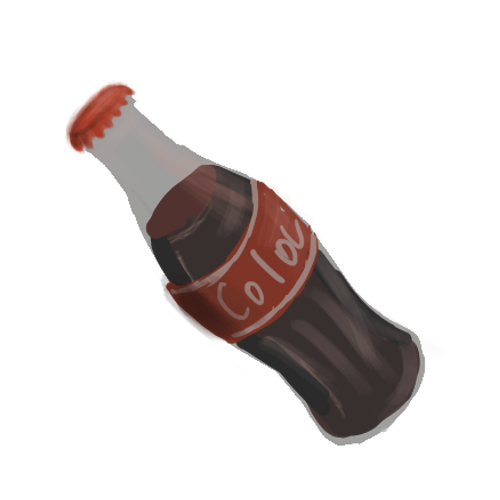</td>
        <td>❌</td>
      </tr>
      <tr>
        <td><a href="./scp/safe/215" style="color:green">SCP-215</a></td>
        <td></td>
        <td>0</td>
        <td>0</td>
        <td>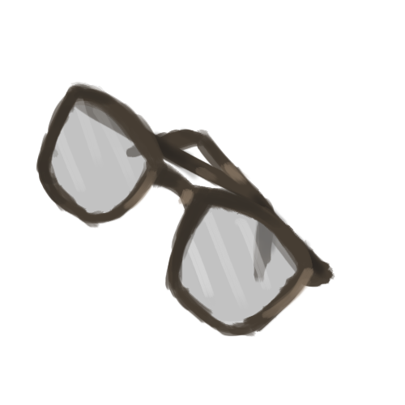</td>
        <td>❌</td>
      </tr>
      <tr>
        <td><a href="./scp/safe/268" style="color:green">SCP-268</a></td>
        <td>OBJECT WITH SHAPESHIFTING PROPERTIES</td>
        <td>0</td>
        <td>0</td>
        <td></td>
        <td>❌</td>
      </tr>
      <tr>
        <td><a href="./scp/safe/300" style="color:green">SCP-300</a></td>
        <td>TOXIC HAZARD</td>
        <td>0</td>
        <td>0</td>
        <td></td>
        <td>❌</td>
      </tr>
      <tr>
        <td><a href="./scp/safe/308" style="color:green">SCP-308</a></td>
        <td>UNKNOWN</td>
        <td>0</td>
        <td>0</td>
        <td>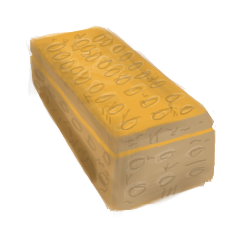</td>
        <td>❌</td>
      </tr>
      <tr>
        <td><a href="./scp/safe/318" style="color:green">SCP-318</a></td>
        <td>UNKNOWN</td>
        <td>0</td>
        <td>0</td>
        <td>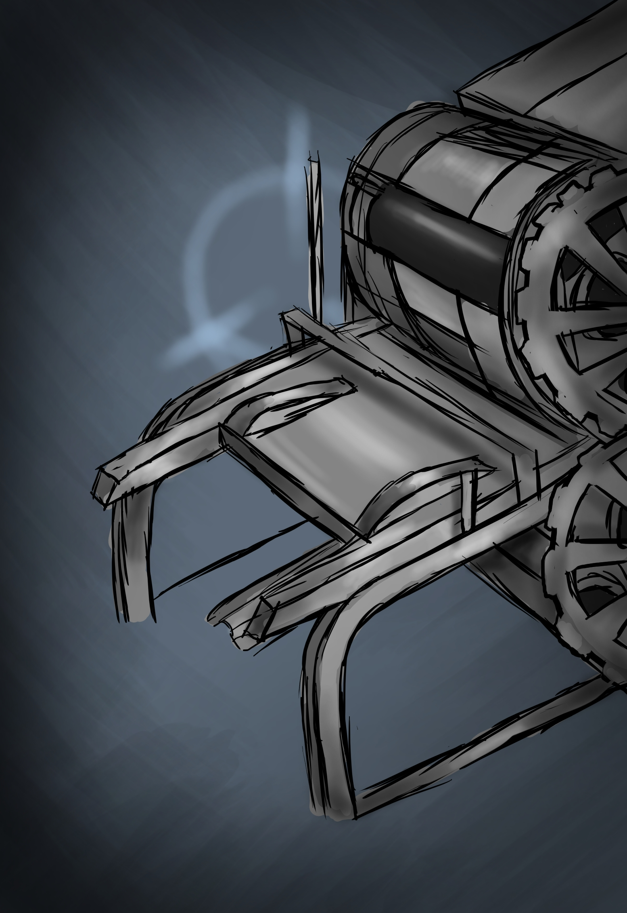</td>
        <td>❌</td>
      </tr>
      <tr>
        <td><a href="./scp/safe/330" style="color:green">SCP-330</a></td>
        <td>INDIRECT INJURY HAZARD</td>
        <td>1</td>
        <td>1</td>
        <td></td>
        <td>❌</td>
      </tr>
      <tr>
        <td><a href="./scp/safe/343" style="color:green">SCP-343</a></td>
        <td>SENTIENT OBJECT, </td>
        <td>0</td>
        <td>0</td>
        <td>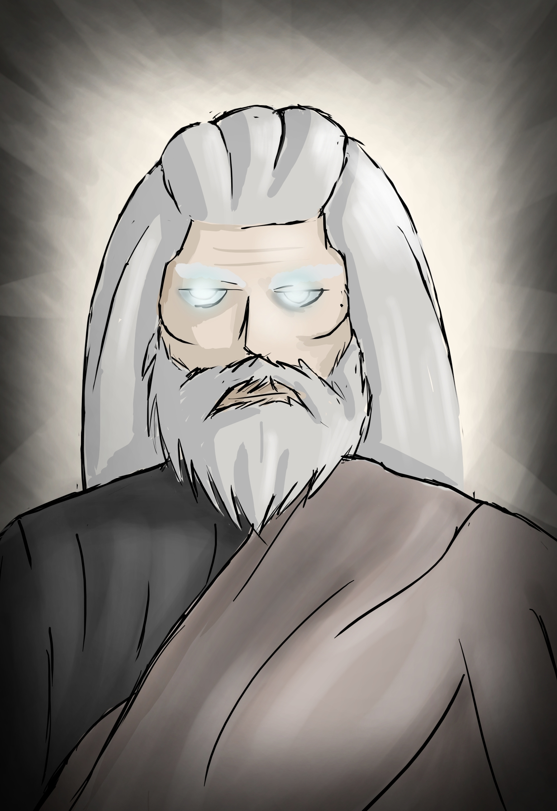</td>
        <td>❌</td>
      </tr>
      <tr>
        <td><a href="./scp/safe/391" style="color:green">SCP-391</a></td>
        <td>SENTIENT OBJECT</td>
        <td>0</td>
        <td>0</td>
        <td></td>
        <td>❌</td>
      </tr>
      <tr>
        <td><a href="./scp/safe/399" style="color:green">SCP-399</a></td>
        <td>UNKNOWN</td>
        <td>0</td>
        <td>0</td>
        <td></td>
        <td>❌</td>
      </tr>
      <tr>
        <td><a href="./scp/safe/427" style="color:green">SCP-427</a></td>
        <td>MUTAGEN HAZARD</td>
        <td>0</td>
        <td>0</td>
        <td>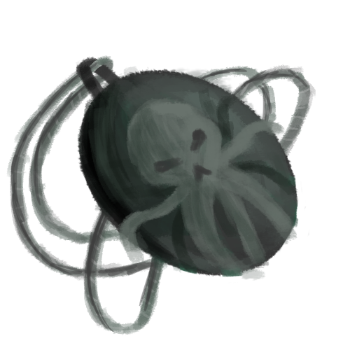</td>
        <td>❌</td>
      </tr>
      <tr>
        <td><a href="./scp/safe/429-J" style="color:green">SCP-429-J</a></td>
        <td>UNKNOWN</td>
        <td>0</td>
        <td>0</td>
        <td></td>
        <td>❌</td>
      </tr>
      <tr>
        <td><a href="./scp/safe/500" style="color:green">SCP-500</a></td>
        <td>UNKNOWN</td>
        <td>0</td>
        <td>0</td>
        <td></td>
        <td>❌</td>
      </tr>
      <tr>
        <td><a href="./scp/safe/696" style="color:green">SCP-696</a></td>
        <td></td>
        <td>0</td>
        <td>0</td>
        <td>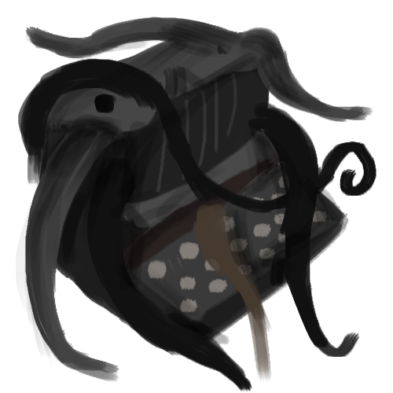</td>
        <td>❌</td>
      </tr>
      <tr>
        <td><a href="./scp/safe/714" style="color:green">SCP-714</a></td>
        <td></td>
        <td>0</td>
        <td>0</td>
        <td>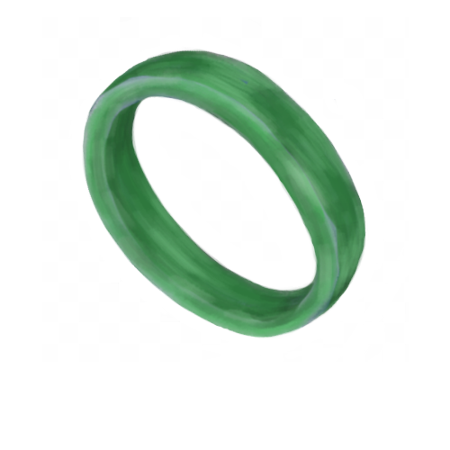</td>
        <td>❌</td>
      </tr>
      <tr>
        <td><a href="./scp/safe/769" style="color:green">SCP-769</a></td>
        <td></td>
        <td>0</td>
        <td>0</td>
        <td>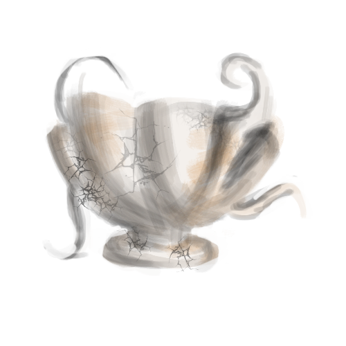</td>
        <td>❌</td>
      </tr>
      <tr>
        <td><a href="./scp/safe/832" style="color:green">SCP-832</a></td>
        <td></td>
        <td>0</td>
        <td>0</td>
        <td>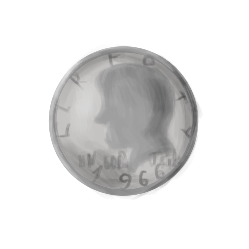</td>
        <td>❌</td>
      </tr>
      <tr>
        <td><a href="./scp/safe/912" style="color:green">SCP-912</a></td>
        <td></td>
        <td>0</td>
        <td>0</td>
        <td>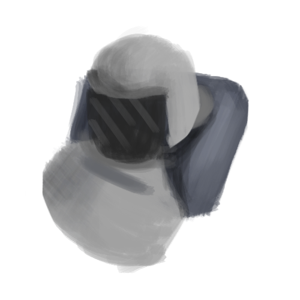</td>
        <td>❌</td>
      </tr>
      <tr>
        <td><a href="./scp/safe/914" style="color:green">SCP-914</a></td>
        <td></td>
        <td>0</td>
        <td>0</td>
        <td>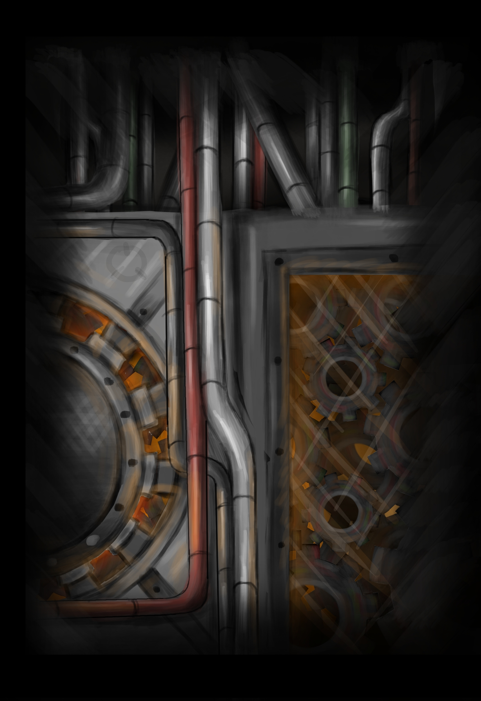</td>
        <td>❌</td>
      </tr>
      <tr>
        <td><a href="./scp/safe/999" style="color:green">SCP-999</a></td>
        <td>SENTIENT OBJECT</td>
        <td>0</td>
        <td>0</td>
        <td></td>
        <td>❌</td>
      </tr>
      <tr>
        <td><a href="./scp/safe/1025" style="color:green">SCP-1025</a></td>
        <td></td>
        <td>0</td>
        <td>0</td>
        <td>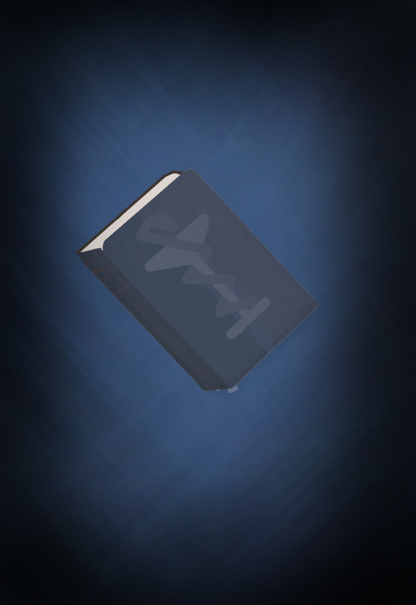</td>
        <td>❌</td>
      </tr>
    </tbody>
</table>

    

<h3 style="color: yellow" id="euclid">EUCLID</h3>

<table>
    <thead>
      <tr>
        <th>ENTRY ITEM</th>
        <th>WARNINGS</th>
        <th>LOGS</th>
        <th>INCIDENTS</th>
        <th>IMAGE</th>
        <th>COMPLETED?</th>
      </tr>
    </thead>
    <tbody>
      <tr>
        <td><a href="./scp/euclid/049" style="color:yellow">SCP-049</a></td>
        <td>SENTIENT AND VIOLENT</td>
        <td>0</td>
        <td>0</td>
        <td></td>
        <td>❌</td>
      </tr>
      <tr>
        <td><a href="./scp/euclid/073" style="color:yellow">SCP-073</a></td>
        <td>SENTIENT</td>
        <td>0</td>
        <td>0</td>
        <td>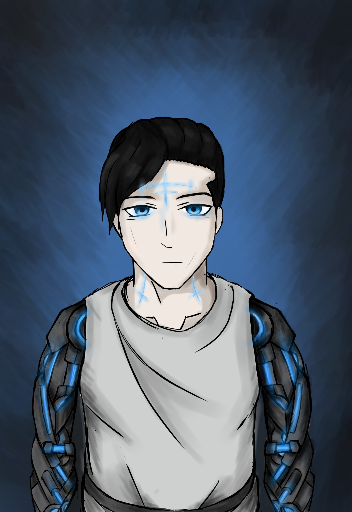</td>
        <td>❌</td>
      </tr>
      <tr>
        <td><a href="./scp/euclid/079" style="color:yellow">SCP-079</a></td>
        <td>SENTIENT</td>
        <td>0</td>
        <td>0</td>
        <td></td>
        <td>❌</td>
      </tr>
      <tr>
        <td><a href="./scp/euclid/082" style="color:yellow">SCP-082</a></td>
        <td>SENTIENT AND VIOLENT</td>
        <td>0</td>
        <td>0</td>
        <td>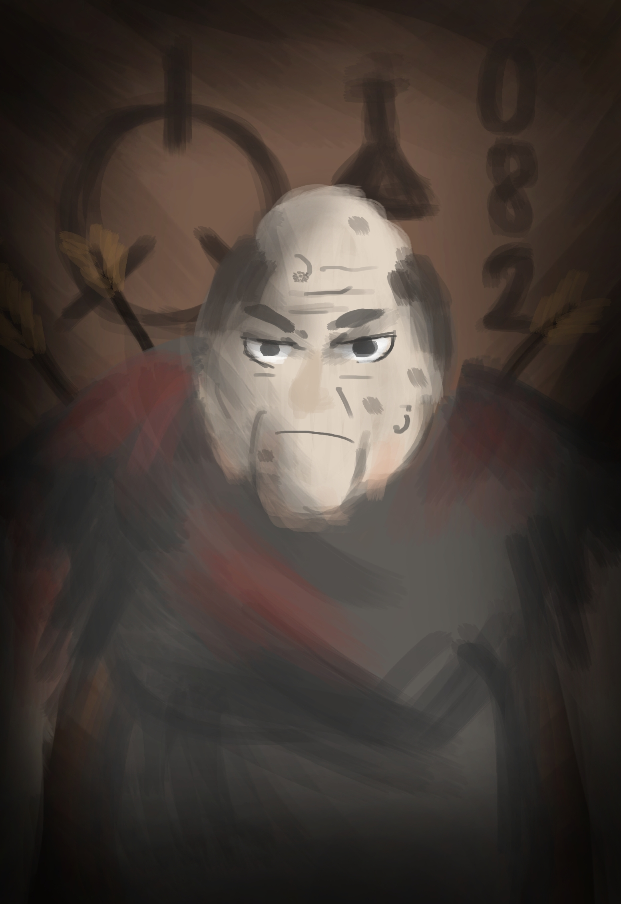</td>
        <td>❌</td>
      </tr>
      <tr>
        <td><a href="./scp/euclid/096" style="color:yellow">SCP-096</a></td>
        <td>VIOLENT AND COGNITOHAZARD</td>
        <td>0</td>
        <td>0</td>
        <td></td>
        <td>❌</td>
      </tr>
      <tr>
        <td><a href="./scp/euclid/123" style="color:yellow">SCP-123</a></td>
        <td>NONSTANDARD SPACETIME, GRAVITATION ANOMALY</td>
        <td>0</td>
        <td>0</td>
        <td>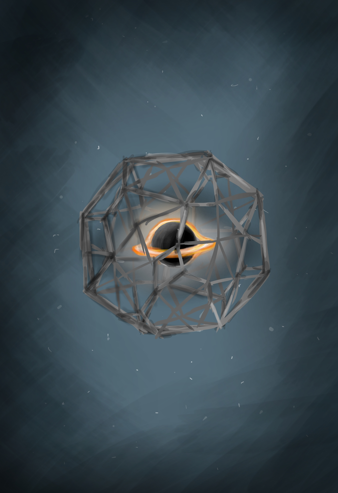</td>
        <td>❌</td>
      </tr>
      <tr>
        <td><a href="./scp/euclid/148" style="color:yellow">SCP-148</a></td>
        <td>COGNITOHAZARD</td>
        <td>0</td>
        <td>0</td>
        <td>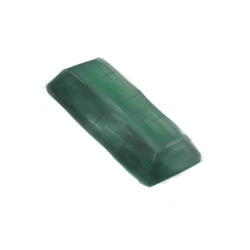</td>
        <td>❌</td>
      </tr>
      <tr>
        <td><a href="./scp/euclid/158" style="color:yellow">SCP-158</a></td>
        <td></td>
        <td>0</td>
        <td>0</td>
        <td>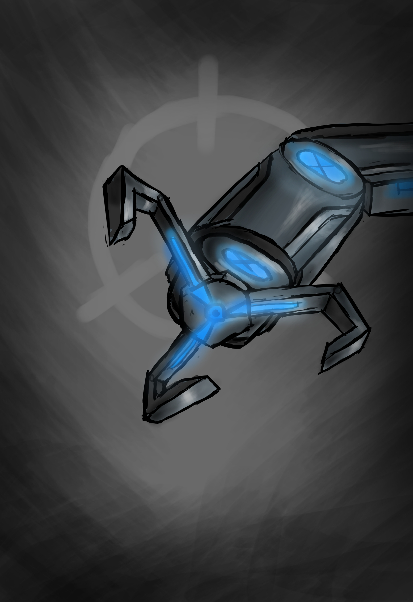</td>
        <td>❌</td>
      </tr>
      <tr>
        <td><a href="./scp/euclid/160" style="color:yellow">SCP-160</a></td>
        <td>AUTONOMOUS, SENTIENT AND VIOLENT</td>
        <td>0</td>
        <td>0</td>
        <td>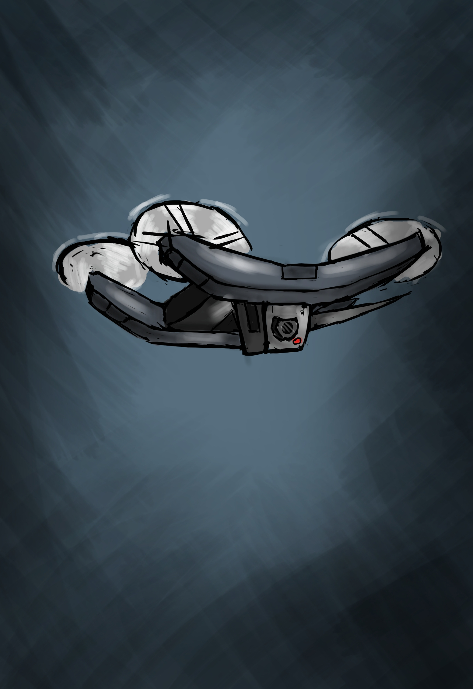</td>
        <td>❌</td>
      </tr>
      <tr>
        <td><a href="./scp/euclid/173" style="color:yellow">SCP-173</a></td>
        <td>SENTIENT AND VIOLENT</td>
        <td>0</td>
        <td>0</td>
        <td>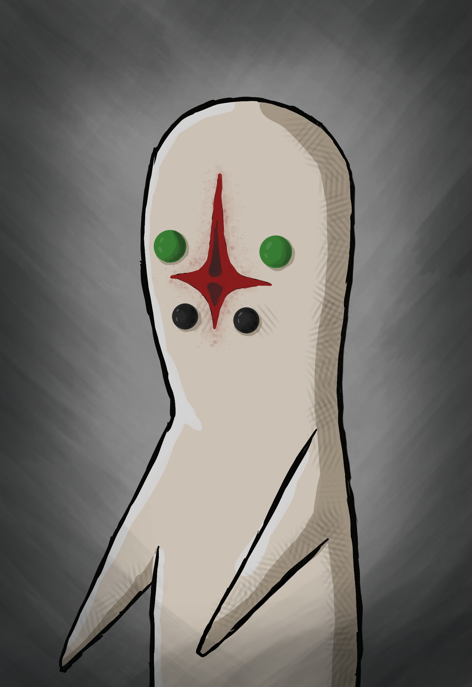</td>
        <td>❌</td>
      </tr>
      <tr>
        <td><a href="./scp/euclid/184" style="color:yellow">SCP-184</a></td>
        <td></td>
        <td>0</td>
        <td>0</td>
        <td>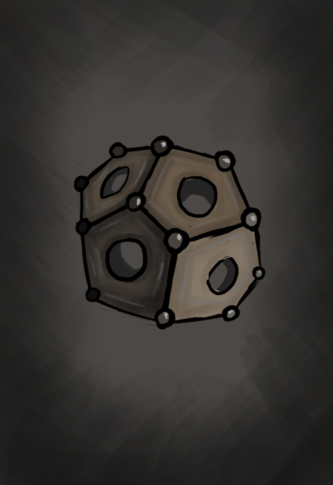</td>
        <td>❌</td>
      </tr>
      <tr>
        <td><a href="./scp/euclid/244" style="color:yellow">SCP-244</a></td>
        <td>FREEZING HAZARD</td>
        <td>0</td>
        <td>0</td>
        <td>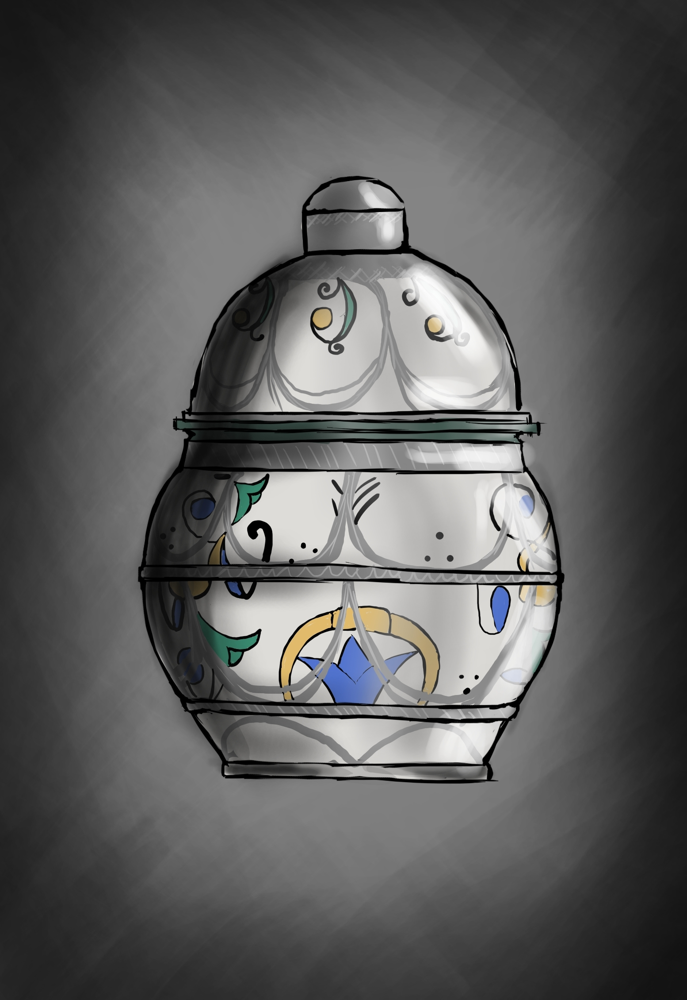</td>
        <td>❌</td>
      </tr>
      <tr>
        <td><a href="./scp/euclid/262" style="color:yellow">SCP-262</a></td>
        <td>SENTIENT</td>
        <td>0</td>
        <td>0</td>
        <td>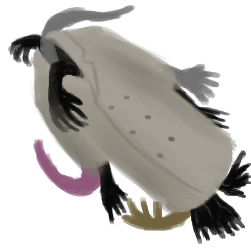</td>
        <td>❌</td>
      </tr>
      <tr>
        <td><a href="./scp/euclid/334" style="color:yellow">SCP-334</a></td>
        <td>FIRE HAZARD, SENTIENT</td>
        <td>0</td>
        <td>0</td>
        <td>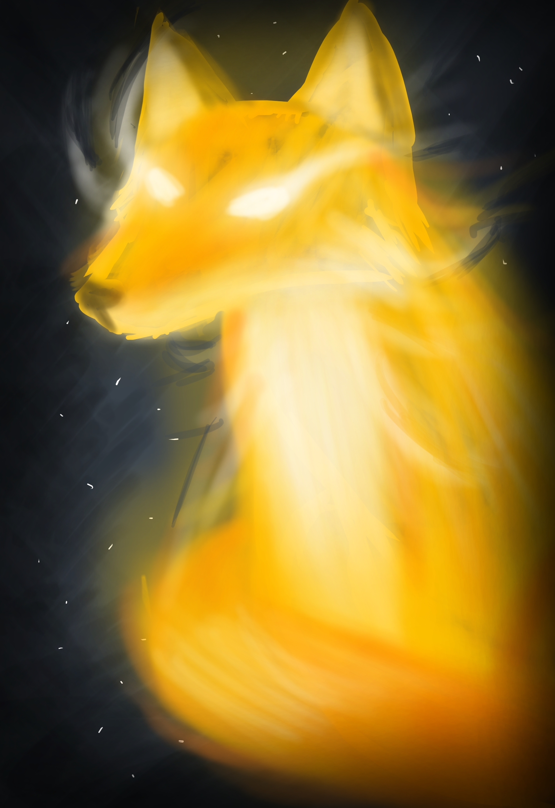</td>
        <td>❌</td>
      </tr>
      <tr>
        <td><a href="./scp/euclid/372" style="color:yellow">SCP-372</a></td>
        <td>AUTOMOMOUS, SENTIENT</td>
        <td>0</td>
        <td>0</td>
        <td></td>
        <td>❌</td>
      </tr>
      <tr>
        <td><a href="./scp/euclid/436" style="color:yellow">SCP-436</a></td>
        <td>UNKNOWN</td>
        <td>0</td>
        <td>0</td>
        <td>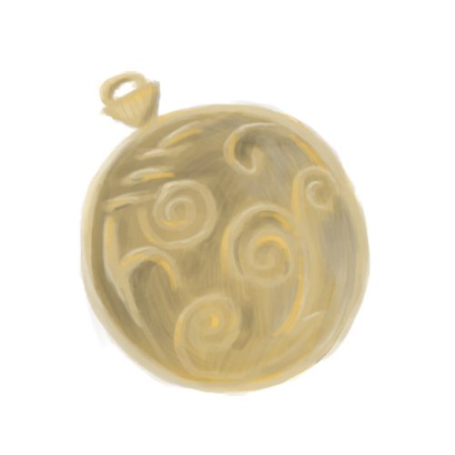</td>
        <td>❌</td>
      </tr>
      <tr>
        <td><a href="./scp/euclid/523" style="color:yellow">SCP-523</a></td>
        <td>INDIRECT INJURY HAZARD, OBJECT WITH SHAPESHIFTING PROPERTIES</td>
        <td>0</td>
        <td>0</td>
        <td>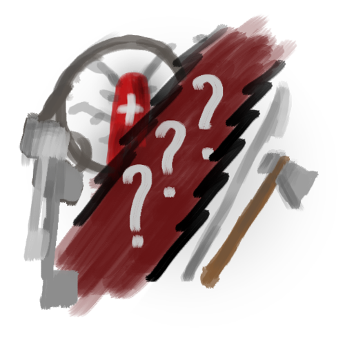</td>
        <td>❌</td>
      </tr>
      <tr>
        <td><a href="./scp/euclid/874" style="color:yellow">SCP-874</a></td>
        <td>COGNITIONHAZARD, AUTONOMOUS</td>
        <td>0</td>
        <td>0</td>
        <td>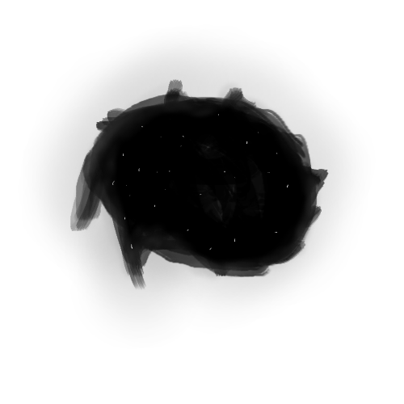</td>
        <td>❌</td>
      </tr>
      <tr>
        <td><a href="./scp/euclid/935" style="color:yellow">SCP-935</a></td>
        <td></td>
        <td>0</td>
        <td>0</td>
        <td>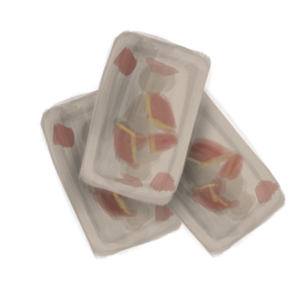</td>
        <td>❌</td>
      </tr>
    </tbody>
</table>

    

<h3 style="color: red" id="keter">KETER</h3>

<table>
    <thead>
      <tr>
        <th>ENTRY ITEM</th>
        <th>WARNINGS</th>
        <th>LOGS</th>
        <th>INCIDENTS</th>
        <th>IMAGE</th>
        <th>COMPLETED?</th>
      </tr>
    </thead>
    <tbody>
      <tr>
        <td><a href="./scp/keter/035" style="color:red">SCP-035</a></td>
        <td>SENTIENT AND VIOLENT</td>
        <td>0</td>
        <td>0</td>
        <td></td>
        <td>❌</td>
      </tr>
      <tr>
        <td><a href="./scp/keter/058" style="color:red">SCP-058</a></td>
        <td>SENTIENT AND VIOLENT</td>
        <td>0</td>
        <td>0</td>
        <td>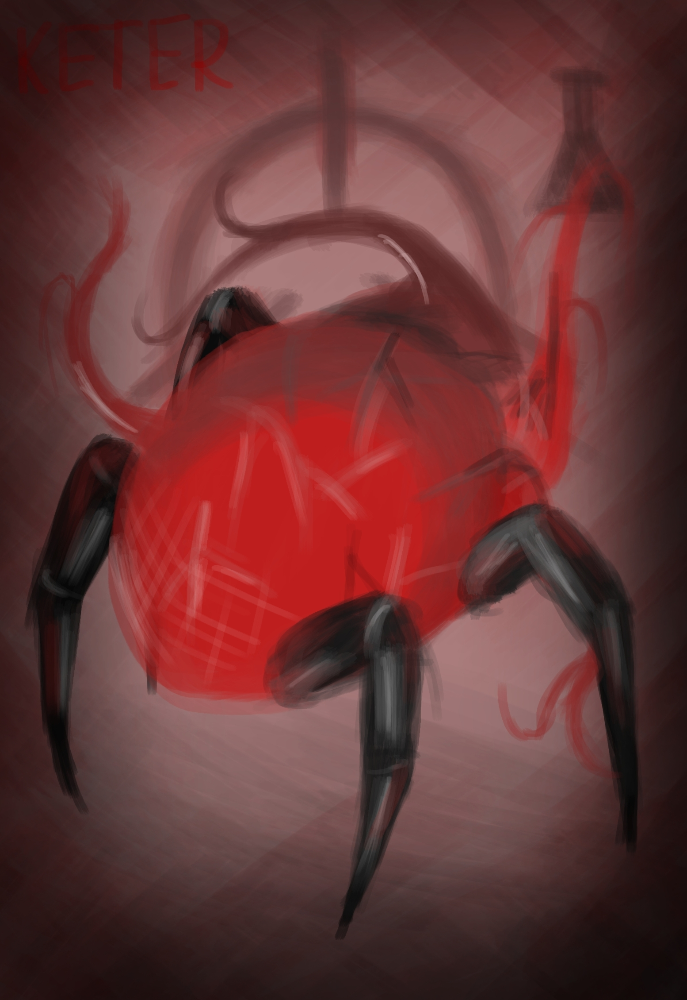</td>
        <td>❌</td>
      </tr>
      <tr>
        <td><a href="./scp/keter/076" style="color:red">SCP-076</a></td>
        <td>SENTIENT, AUTONOMOUS</td>
        <td>0</td>
        <td>0</td>
        <td>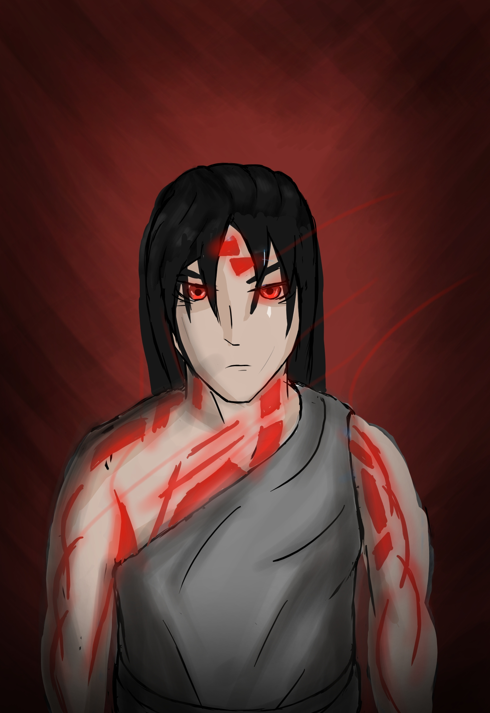</td>
        <td>❌</td>
      </tr>
      <tr>
        <td><a href="./scp/keter/106" style="color:red">SCP-106</a></td>
        <td>SENTIENT AND VIOLENT, NONSTANDARD SPACETIME</td>
        <td>0</td>
        <td>0</td>
        <td></td>
        <td>❌</td>
      </tr>
      <tr>
        <td><a href="./scp/keter/169" style="color:red">SCP-169</a></td>
        <td>UNKNOWN: HANDLE WITH CAUTION</td>
        <td>0</td>
        <td>0</td>
        <td></td>
        <td>❌</td>
      </tr>
      <tr>
        <td><a href="./scp/keter/204" style="color:red">SCP-204</a></td>
        <td>UNKNOWN: HANDLE WITH CAUTION</td>
        <td>0</td>
        <td>0</td>
        <td>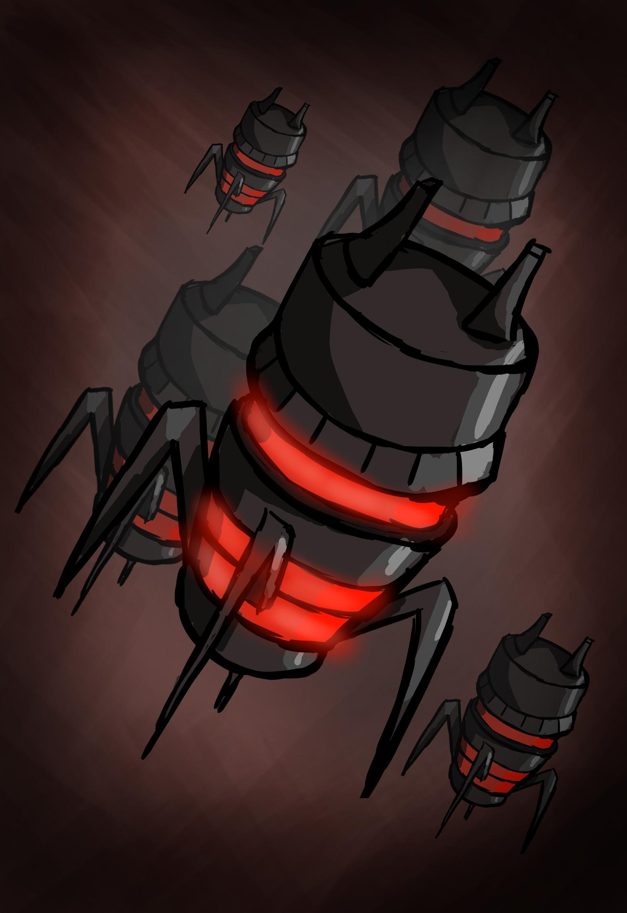</td>
        <td>❌</td>
      </tr>
      <tr>
        <td><a href="./scp/keter/280" style="color:red">SCP-280</a></td>
        <td>SENTIENT AND VIOLENT</td>
        <td>0</td>
        <td>0</td>
        <td></td>
        <td>❌</td>
      </tr>
      <tr>
        <td><a href="./scp/keter/682" style="color:red">SCP-682</a></td>
        <td>SENTIENT AND VIOLENT</td>
        <td>0</td>
        <td>0</td>
        <td>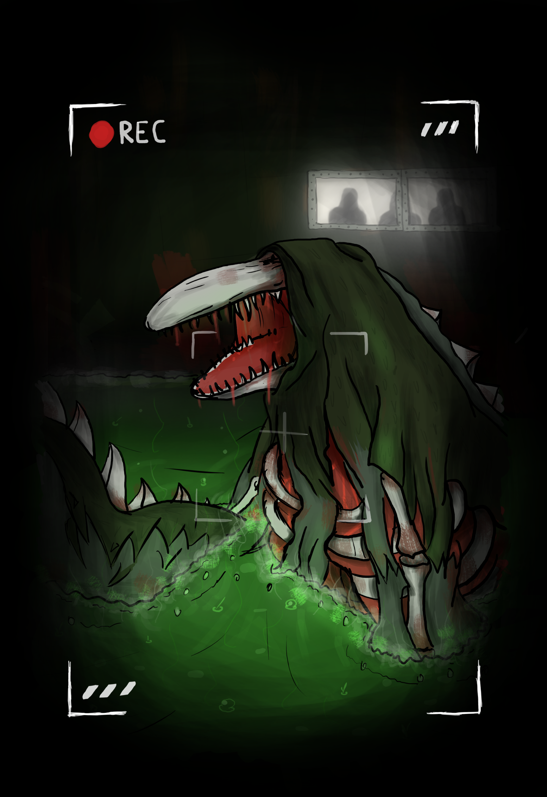</td>
        <td>❌</td>
      </tr>
    </tbody>
</table>    

    

<h3 style="color: purple" id="apollyon">APOLLYON</h3>
<table>
    <thead>
      <tr>
        <th>ENTRY ITEM</th>
        <th>WARNINGS</th>
        <th>LOGS</th>
        <th>INCIDENTS</th>
        <th>IMAGE</th>
        <th>COMPLETED?</th>
      </tr>
    </thead>
    <tbody>
      <tr>
        <td><del><a href="./scp/apollyon/001/001-01" style="color:PURPLE; cursor:not-allowed">SCP-001 SCARLET KING</a></del></td>
        <td><del>XK-CLASS SZENARIO</del></td>
        <td><del>0</del></td>
        <td><del>0</del></td>
        <td><del></del></td>
        <td><del>❌</del></td>
      </tr>
    </tbody>
</table>

    

<h2 tabindex="3" id="characters">CHARACTERS</h2>

<table>
    <thead>
      <tr>
        <th>NAME</th>
        <th>GROUP</th>
        <th>LOGS</th>
        <th>INCIDENTS</th>
        <th>IMAGE</th>
        <th>COMPLETED?</th>
      </tr>
    </thead>
    <tbody>
      <tr>
        <td><a href="./humans/foundation/0511" style="color:white">05-11</a></td>
        <td>SCPF</td>
        <td>0</td>
        <td>0</td>
        <td></td>
        <td>❌</td>
      </tr>
      <tr>
        <td><a href="./humans/foundation/assistant" style="color:white">ASSISTANT</a></td>
        <td>SCPF</td>
        <td>0</td>
        <td>0</td>
        <td></td>
        <td>❌</td>
      </tr>
      <tr>
        <td><a href="./humans/other/fbi" style="color:white">FBI AGENT</a></td>
        <td>FBI</td>
        <td>0</td>
        <td>0</td>
        <td></td>
        <td>❌</td>
      </tr>
      <tr>
        <td><a href="./humans/other/goc" style="color:white">GOC SOLDIER</a></td>
        <td>GOC</td>
        <td>0</td>
        <td>0</td>
        <td></td>
        <td>❌</td>
      </tr>
      <tr>
        <td><a href="./humans/foundation/homd" style="color:white">HEAD OF MEDICAL DEPARTMENT</a></td>
        <td>SCPF</td>
        <td>0</td>
        <td>0</td>
        <td></td>
        <td>❌</td>
      </tr>
      <tr>
        <td><a href="./humans/foundation/hosd" style="color:white">HEAD OF SCIENTIFIC DEPARTMENT</a></td>
        <td>SCPF</td>
        <td>0</td>
        <td>0</td>
        <td></td>
        <td>❌</td>
      </tr>
      <tr>
        <td><a href="./humans/foundation/gensecurity" style="color:white">HEAD OF SECURITY</a></td>
        <td>SCPF</td>
        <td>0</td>
        <td>0</td>
        <td></td>
        <td>❌</td>
      </tr>
      <tr>
        <td><a href="./humans/foundation/janitor" style="color:white">JANITOR</a></td>
        <td>SCPF</td>
        <td>1</td>
        <td>0</td>
        <td></td>
        <td>❌</td>
      </tr>
      <tr>
        <td><a href="./humans/foundation/scientist" style="color:white">SCIENTIST</a></td>
        <td>SCPF</td>
        <td>0</td>
        <td>0</td>
        <td></td>
        <td>❌</td>
      </tr>
      <tr>
        <td><a href="./humans/foundation/scp-researcher" style="color:white">SCP-RESEARCHER</a></td>
        <td>SCPF</td>
        <td>0</td>
        <td>0</td>
        <td></td>
        <td>❌</td>
      </tr>
      <tr>
        <td><a href="./humans/foundation/fg" style="color:white">SECURITY GUARD</a></td>
        <td>SCPF</td>
        <td>0</td>
        <td>0</td>
        <td></td>
        <td>❌</td>
      </tr>
    </tbody>
</table>

    

<h2 id="items" tabindex="4">ITEMS</h2>

<table>
    <thead>
      <tr>
        <th>ITEM</th>
        <th>IMAGE</th>
        <th>COMPLETED?</th>
      </tr>
    </thead>
    <tbody>
      <tr>
        <td><a href="./items/amnesiac" style="color:white">AMNESIAC</a></td>
        <td></td>
        <td>❌</td>
      </tr>
    </tbody>
</table>

    

<h2 id="events" tabindex="5">EVENTS</h2>

<table>
    <thead>
      <tr>
        <th>NAME</th>
        <th>EFFECT</th>
        <th>IMAGE</th>
        <th>COMPLETED?</th>
      </tr>
    </thead>
    <tbody>
      <tr>
        <td><a href="./events/cuthands" style="color:red">CUT HANDS</a></td>
        <td>NEGATIVE</td>
        <td></td>
        <td>❌</td>
      </tr>
    </tbody>
</table>

    

<h2 id="deaths" tabindex="6">DEATHS</h2>

<table>
    <thead>
      <tr>
        <th>DEATH</th>
        <th>IMAGE</th>
        <th>COMPLETED?</th>
      </tr>
    </thead>
    <tbody>
      <tr>
        <td>&nbsp;</td>
        <td></td>
        <td>❌</td>
      </tr>
    </tbody>
</table>

    

<h2 id="achivements" tabindex="7">ACHIVEMENTS</h2>

<table>
    <thead>
      <tr>
        <th>ACHIVEMENT</th>
        <th>IMAGE</th>
        <th>COMPLETED?</th>
      </tr>
    </thead>
    <tbody>
      <tr>
        <td><a href="./achivements/lostsoul" style="color:white">LOST SOUL</a></td>
        <td></td>
        <td>✔️</td>
      </tr>
      <tr>
        <td><a href="./achivements/rea" style="color:white">REAL ESTATE AGENT</a></td>
        <td></td>
        <td>✔️</td>
      </tr>
      <tr>
        <td><a href="./achivements/coc" style="color:white">CALL OF CTHULHU</a></td>
        <td></td>
        <td>❌</td>
      </tr>
      <tr>
        <td><a href="./achivements/ec" style="color:white">EDEN CLOCK</a></td>
        <td></td>
        <td>❌</td>
      </tr>
      <tr>
        <td><a href="./achivements/dod" style="color:white">DESCENDANT OF DARWIN</a></td>
        <td></td>
        <td>✔️</td>
      </tr>
      <tr>
        <td><a href="./achivements/u25" style="color:white">UTOPIA 25</a></td>
        <td></td>
        <td>✔️</td>
      </tr>
      <tr>
        <td><a href="./achivements/anb" style="color:white">A NEW BEGINNING</a></td>
        <td></td>
        <td>✔️</td>
      </tr>
      <tr>
        <td><a href="./achivements/c" style="color:white">CLEANER</a></td>
        <td></td>
        <td>✔️</td>
      </tr>
      <tr>
        <td><a href="./achivements/p" style="color:white">PLEONEXIA</a></td>
        <td></td>
        <td>❌</td>
      </tr>
      <tr>
        <td><a href="./achivements/wwyd" style="color:white">WHY WON’T YOU DIE?</a></td>
        <td></td>
        <td>✔️</td>
      </tr>
      <tr>
        <td><a href="./achivements/tdk" style="color:white">THEY DON’T KNOW</a></td>
        <td></td>
        <td>✔️</td>
      </tr>
      <tr>
        <td>???</td>
        <td>???</td>
        <td>???</td>
      </tr>
      <tr>
        <td>???</td>
        <td>???</td>
        <td>???</td>
      </tr>
    </tbody>
</table>

    

<h2 id="endings" tabindex="8">ENDINGS</h2>

<table>
    <thead>
      <tr>
        <th>ENDING</th>
        <th>IMAGE</th>
        <th>COMPLETED?</th>
      </tr>
    </thead>
    <tbody>
      <tr>
        <td>&nbsp;</td>
        <td></td>
        <td>❌</td>
      </tr>
    </tbody>
</table>

    

    
    
    
    
    
    
    
    

